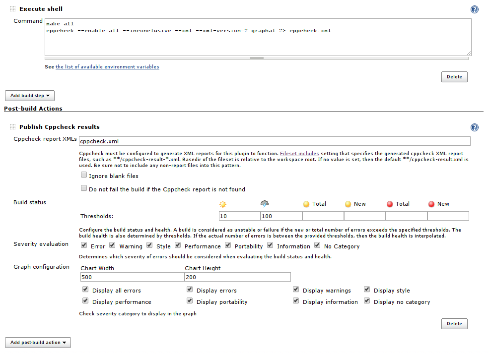

Cppcheck Plugin
===============

This plugin generates the trend report for [CppCheck](http://cppcheck.wiki.sourceforge.net/), a tool for static C/C++ code analysis.

# Description

The Cppcheck plug-in scans for Cppcheck report files in the build workspace and reports the issues detected during static C/C++ code analysis.

The following features are provided by this plug-in:

- Configuration of the files to scan after a build, build status evaluation and graph.
- Trend reports showing the number of detected issues per type.
- Results summary and results details including new issues and solved issues.
- Listing of source code with highlighted issues.
- Show all violations highlighted on a single page.
- [Dashboard View](https://wiki.jenkins.io/display/JENKINS/Dashboard+View) portlet showing number of issues per job.
- Remote access API ([REST API](https://wiki.jenkins-ci.org/display/JENKINS/Remote+access+API)).
- Works with most project/job types.

Please use the [Mailing Lists](https://wiki.jenkins.io/display/JENKINS/Mailing+Lists) or [issue tracker](http://issues.jenkins-ci.org/) to ask questions, create feature request or bug reports.

# Usage

- Install [Cppcheck](http://cppcheck.sourceforge.net/) tool to the system. If you use master Jenkins server and several build slaves, install it to all slaves that will run the analysis.
- For each job configuration page:
    - Add **Execute shell** build step to generate Cppcheck report or create the report file in your build scripts (Ant, Maven, Make, ...).
    - Activate **Publish Cppcheck results** in **Post-build Actions** and provide at least the path to the generated Cppcheck report (cppcheck.xml).
    - Optionally configure build status evaluation (**Advanced** button).
    - Optionally configure graph (second level **Advanced** button).
- **Always prefer new XML version 2 for the output format.** XML version 1 is supported in the plugin too, but Cppcheck doesn't report some issues with the legacy format.

```
# Minimal set of arguments
cppcheck --xml --xml-version=2 SOURCE_DIRECTORY 2> cppcheck.xml

# Enable all checks
cppcheck --enable=all --inconclusive --xml --xml-version=2 SOURCE_DIRECTORY 2> cppcheck.xml

# Analysis in multiple parallel threads
cppcheck -j 4 --enable=all --inconclusive --xml --xml-version=2 SOURCE_DIRECTORY 2> cppcheck.xml
```



## Report in a sub-directory of the workspace (advanced)

**The plugin expects that all paths in the input report file (**`cppcheck.xml`**) are relative to the workspace root directory.** If the Cppcheck tool is executed from a sub-directory, the plugin will be unable to pair the paths in the report with the files on disk and **the source codes with the highlighted errors won't be available in the details**.

```
# In the workspace root directory
cd SUBDIRECTORY
cppcheck --enable=all --inconclusive --xml --xml-version=2 INPUT_DIRECTORY 2> cppcheck.xml
```

See the warning in the Console Output below. The invalid absolute path is missing `SUBDIRECTORY` between `workspace` and `INPUT_DIRECTORY` directories.

```
[Cppcheck] Starting the cppcheck analysis.
[Cppcheck] Processing 1 files with the pattern '**/cppcheck.xml'.
[Cppcheck] [WARNING] - The source file 'file:/SHORTENED/work/jobs/JOB_NAME/workspace/INPUT_DIRECTORY/mainwindow.cpp'
doesn't exist on the slave. The ability to display its source code has been removed.
...
```

There are basically two solutions for this issue. The first one is to execute the Cppcheck analysis directly from the workspace root directory to make `SUBDIRECTORY` part of the path.

```
# In the workspace root directory
# cd SUBDIRECTORY
# cppcheck --enable=all --inconclusive --xml --xml-version=2 INPUT_DIRECTORY 2> cppcheck.xml

cppcheck --enable=all --inconclusive --xml --xml-version=2 SUBDIRECTORY/INPUT_DIRECTORY 2> SUBDIRECTORY/cppcheck.xml
```

But the above solution is not much suitable for larger projects that are using for example recursive GNU/Make based build scripts where the Cppcheck analysis is executed for each sub-project (sub-directory). It is better to modify the paths in the report files after they are created.

```
# In the workspace root directory
cd SUBDIRECTORY
cppcheck --enable=all --inconclusive --xml --xml-version=2 INPUT_DIRECTORY 2> cppcheck.xml
sed -i 's%\(<location file="\)%\1SUBDIRECTORY/%' cppcheck.xml
```

The `sed` command above adds "`SUBDIRECTORY/`" to the beginning of the paths in the `location` elements. Note this method is not limited only to `sed`, you can use whatever tool that is able to replace string in a file.

```
<location file="INPUT_DIRECTORY/mainwindow.cpp" line="1134"/>
<location file="SUBDIRECTORY/INPUT_DIRECTORY/mainwindow.cpp" line="1134"/>
```

# Remote access API ([REST API](https://wiki.jenkins-ci.org/display/JENKINS/Remote+access+API))

Use the URLs below to access the Cppcheck specific data.

Description of possibilities

- [http://SERVER/job/JOB\_NAME/BUILD\_NUMBER/cppcheckResult/api](http://server/job/JOB_NAME/BUILD_NUMBER/cppcheckResult/api)

Data

- [http://SERVER/job/JOB\_NAME/BUILD\_NUMBER/cppcheckResult/api/xml](http://server/job/JOB_NAME/BUILD_NUMBER/cppcheckResult/api/xml)
- [http://SERVER/job/JOB\_NAME/BUILD\_NUMBER/cppcheckResult/api/json](http://server/job/JOB_NAME/BUILD_NUMBER/cppcheckResult/api/json)
- etc.

Example of XML data:

```
<cppcheckStatistics>
    <numberErrorSeverity>0</numberErrorSeverity>
    <numberInformationSeverity>7</numberInformationSeverity>
    <numberNoCategorySeverity>0</numberNoCategorySeverity>
    <numberPerformanceSeverity>20</numberPerformanceSeverity>
    <numberPortabilitySeverity>0</numberPortabilitySeverity>
    <numberStyleSeverity>22</numberStyleSeverity>
    <numberTotal>54</numberTotal>
    <numberWarningSeverity>5</numberWarningSeverity>
</cppcheckStatistics>
```

Example of JSON data:

```

{
    "numberErrorSeverity" : 0,
    "numberInformationSeverity" : 7,
    "numberNoCategorySeverity" : 0,
    "numberPerformanceSeverity" : 20,
    "numberPortabilitySeverity" : 0,
    "numberStyleSeverity" : 22,
    "numberTotal" : 54,
    "numberWarningSeverity" : 5
}
```

# Known Issues

[View these issues in
Jira](https://issues.jenkins-ci.org/secure/IssueNavigator.jspa?reset=true&jqlQuery=project%20=%20JENKINS%20AND%20status%20in%20%28Open,%20%22In%20Progress%22,%20Reopened%29%20AND%20component%20=%20%27cppcheck-plugin%27&tempMax=1000&src=confmacro)
